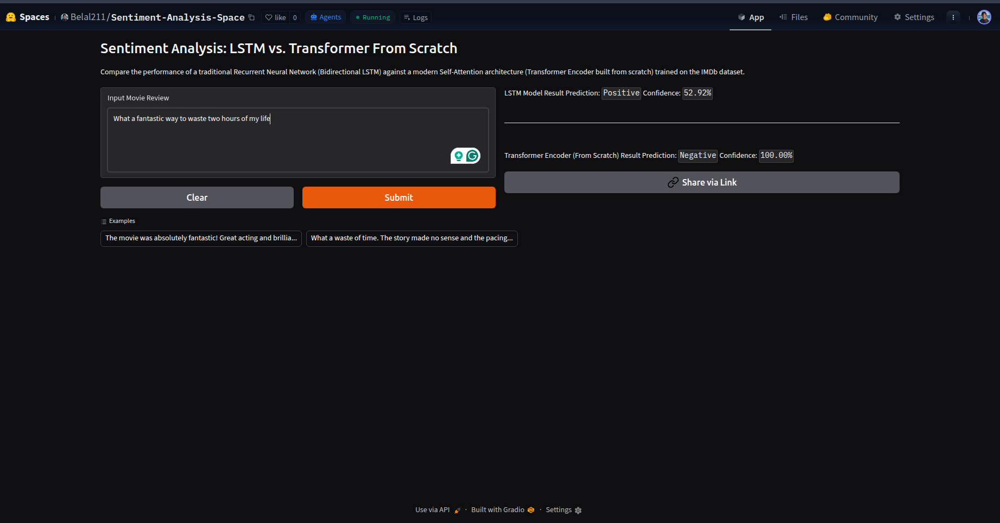

# Sentiment Analysis: LSTM vs Transformer From Scratch

**Live Demo:** https://huggingface.co/spaces/Belal211/Sentiment-Analysis-Space

**GitHub Repository:** https://github.com/belalfathy211/Sentiment-Analysis

---

An end-to-end NLP project that compares a **Bidirectional LSTM** with a **Transformer Encoder implemented entirely from scratch using PyTorch** for binary sentiment classification on the IMDb Movie Reviews dataset.

Rather than relying on pretrained Transformer libraries, this project implements the core Transformer Encoder components manually, including Multi-Head Self-Attention, Sinusoidal Positional Encoding, Residual Connections, and Layer Normalization.

---

## Demo Preview



---

## Highlights

* Built a complete NLP pipeline from scratch
* Custom Vocabulary & Tokenization
* Dynamic Padding & Attention Masks
* Bidirectional LSTM Baseline
* Transformer Encoder Implemented From Scratch
* Multi-Head Self-Attention
* Sinusoidal Positional Encoding
* Residual Connections & Layer Normalization
* Gradio Interactive Demo
* Achieved ~90% Validation Accuracy on IMDb Reviews

---

## Project Overview

The goal of this project was to understand how different deep learning architectures handle sentiment analysis while implementing every stage of the NLP workflow manually.

The project includes:

* Custom text preprocessing
* Vocabulary construction
* Numerical encoding
* Dynamic batching
* Bidirectional LSTM
* Transformer Encoder from scratch
* Training & evaluation pipeline
* Interactive Gradio deployment

The final system allows users to compare predictions from both architectures side by side.

---

## Dataset

### IMDb Movie Reviews Dataset

* 50,000 movie reviews
* Binary sentiment classification
* Positive / Negative labels

The dataset is widely used as a benchmark for sentiment analysis tasks.

---

## NLP Pipeline

### Text Preprocessing

The preprocessing pipeline includes:

* Lowercasing text
* Removing HTML tags
* Removing punctuation and special symbols
* Tokenization
* Vocabulary construction
* Numerical encoding

Example:

```text
Original:
"I absolutely love this product!!! <br />"

Processed:
["i", "absolutely", "love", "this", "product"]
```

### Vocabulary Construction

A custom vocabulary system was implemented from scratch.

Special tokens:

* `<PAD>`
* `<UNK>`
* `<START>`
* `<END>`

Words appearing fewer than the specified frequency threshold are excluded from the vocabulary.

---

## Data Loading Pipeline

Custom PyTorch Dataset and DataLoader implementations were used.

Features:

* Dynamic batch padding
* Attention mask generation
* Train/Validation split
* Reproducible splitting using fixed random seeds

This design minimizes unnecessary computation while supporting Transformer attention masking.

---

# Model 1: Bidirectional LSTM

Architecture:

```text
Input Tokens
      ↓
Embedding Layer
      ↓
2-Layer BiLSTM
      ↓
Dropout
      ↓
Fully Connected Layer
      ↓
Sentiment Prediction
```

Configuration:

| Parameter           | Value |
| ------------------- | ----- |
| Embedding Dimension | 100   |
| Hidden Dimension    | 256   |
| Number of Layers    | 2     |
| Bidirectional       | Yes   |
| Dropout             | 0.5   |

---

# Model 2: Transformer Encoder (Built From Scratch)

Unlike using built-in Transformer models, this implementation was built manually using PyTorch modules.

### Components Implemented

### Positional Encoding

Implemented sinusoidal positional encoding based on the original Transformer paper.

### Multi-Head Self-Attention

Implemented manually using:

* Query projections
* Key projections
* Value projections
* Scaled Dot-Product Attention

### Transformer Encoder Block

Each encoder layer contains:

* Multi-Head Self-Attention
* Residual Connections
* Layer Normalization
* Feed Forward Network
* Dropout

### Classification Head

Instead of using a CLS token, the model uses:

**Masked Global Average Pooling**

to aggregate token representations while ignoring padded positions.

---

## Transformer Architecture

```text
Input Tokens
      ↓
Embedding Layer
      ↓
Positional Encoding
      ↓
Transformer Encoder Layers
      ↓
Masked Global Average Pooling
      ↓
Fully Connected Layer
      ↓
Sentiment Prediction
```

Configuration:

| Parameter              | Value |
| ---------------------- | ----- |
| Embedding Dimension    | 128   |
| Attention Heads        | 4     |
| Feed Forward Dimension | 512   |
| Encoder Layers         | 2     |
| Dropout                | 0.5   |

---

## Training

### Loss Function

```python
BCEWithLogitsLoss()
```

### Optimizer

```python
Adam
```

### Checkpointing

The best model is automatically saved based on validation loss.

Saved checkpoint includes:

* Model weights
* Optimizer state
* Validation loss
* Training epoch

---

## Results

| Model                    | Validation Accuracy |
| ------------------------ | ------------------- |
| Bidirectional LSTM       | ~89%                |
| Transformer From Scratch | ~90%                |

The Transformer achieved slightly better validation performance while demonstrating the effectiveness of self-attention mechanisms for sentiment classification.

---

## Interesting Observations

While both models achieved strong benchmark accuracy, testing revealed several common NLP challenges:

### Negation

```text
"The movie was not good."
```

### Double Negation

```text
"The movie was not bad."
```

### Sarcasm

```text
"What a fantastic way to waste two hours of my life."
```

### Informal Language & Misspellings

```text
"It's shiiiiiiit"
```

These examples highlight the difference between benchmark accuracy and genuine language understanding.

---

## Project Structure

```text
Sentiment-Analysis/
│
├── data/
│   ├── raw/
│   └── processed/
│
├── models/
│   ├── sentiment_lstm_model.pth
│   └── scratch_transformer_model.pth
│
├── src/
│   ├── models/
│   │   ├── lstm_model.py
│   │   └── scratch_transformer_model.py
│   │
│   ├── preprocess.py
│   ├── vocabulary_class.py
│   ├── data_loader.py
│   ├── train.py
│   └── predict.py
│
├── config.json
├── requirements.txt
└── README.md
```

---

## Running the Project

### Clone the repository

```bash
git clone https://github.com/belalfathy211/Sentiment-Analysis.git

cd Sentiment-Analysis
```

### Install dependencies

```bash
pip install -r requirements.txt
```

### Train a model

```bash
python src/train.py
```

### Launch the Gradio demo

```bash
python src/predict.py
```

---

## Future Improvements

* Subword tokenization (BPE / WordPiece)
* Better negation handling
* Hyperparameter optimization
* Larger Transformer architectures
* Pretrained word embeddings
* Comparison with BERT and RoBERTa
* Explainability tools (Attention Visualization)

---

## Technologies Used

* Python
* PyTorch
* Gradio
* Pandas
* NumPy

---

## Author

**Belal Fathy**

AI & Machine Learning Enthusiast

Interested in:

* Deep Learning
* Natural Language Processing
* Computer Vision
* Transformer Architectures

Feel free to connect with me on LinkedIn {www.linkedin.com/in/belal-fathy-62033824a} and share feedback about the project.
